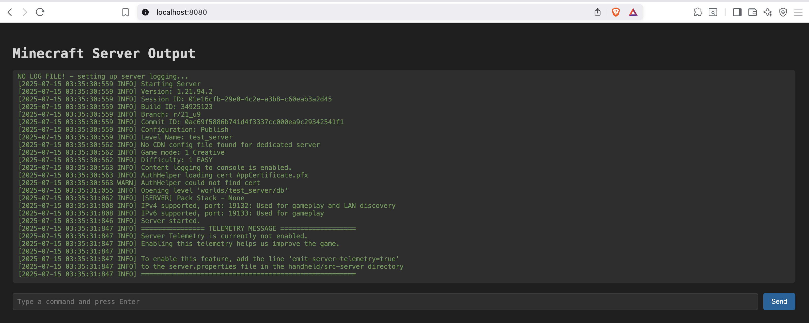

Run Minecraft Server Bedrock Edition in a container with docker compose or kubernetes/helm.  

The version of the server is static in the repo and is updated via the `Version Check` Github Action.

This repository contains a golang wrapper for running the server as well as an interactive web UI for view the console
and typing console commands.



**Docker**

Stand up Minecraft Server Bedrock Edition with Docker:
```
docker compose up -d
```
View logs:
```
docker compose logs -f server
```
View logs and run console commands via web ui http://localhost:8080

**Kubernetes**

Install:
```
helm upgrade --install <release_name> oci://ghcr.io/jsandas/minecraft-bedrock
```
Example install with specific namespace and custom values file:
```
helm upgrade --install minecraft-bedrock oci://ghcr.io/jsandas/minecraft-bedrock -f custom-values.yaml --namespace minecraft --create-namespace
```

To manage minecraft server (assuming a single deployment of minecraft per namespace):
```
export POD=$(kubectl get -n <namespace> pods | grep -v NAME | cut -d " " -f1)
kubectl exec -n <namespace> -it $POD -- bash -c "./mccli"
```
Example:
```
export POD=$(kubectl get -n minecraft pods | grep -v NAME | cut -d " " -f1)
kubectl exec -n minecraft -it $POD -- bash -c "./mccli"
```
The mccli behaves similar to the standard minecraft console.  Commands such as `help` or `gamerule` can run.  When done use `ctrl+c` to exit mccli.

Notes:
Minecraft Bedrock Server application is unable to broadcast outside of the kubernetes network. Clients will need to be configured to connect to the server's ip address or hostname unless `hostNetwork` is set to `true`.  If `hostNetwork` is `true` ensure that `service.port` is unique if depoloying more that on instance of Minecraft Bedrock Server.